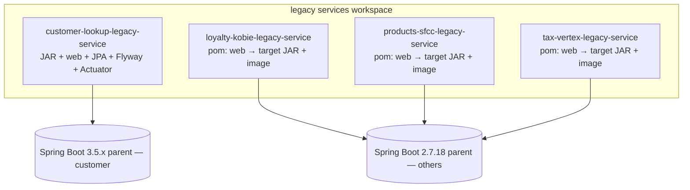
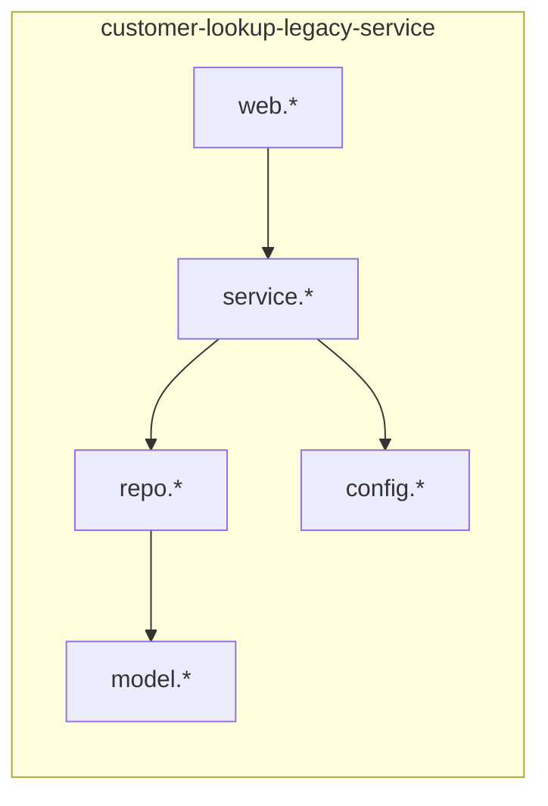
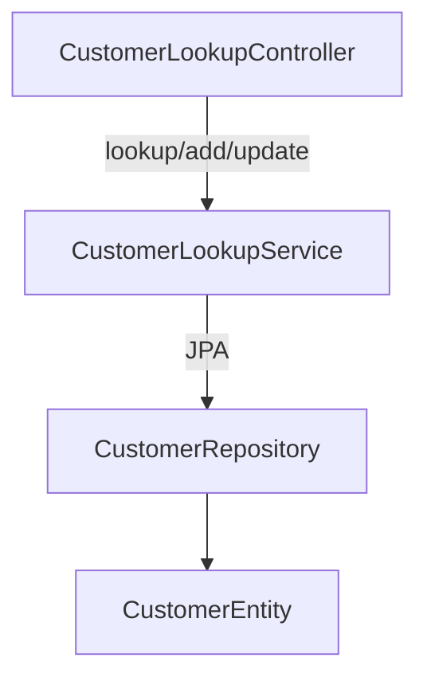
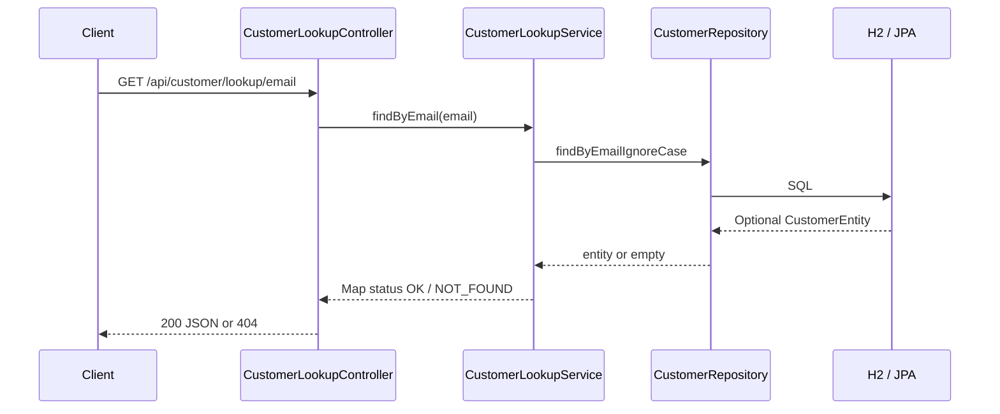
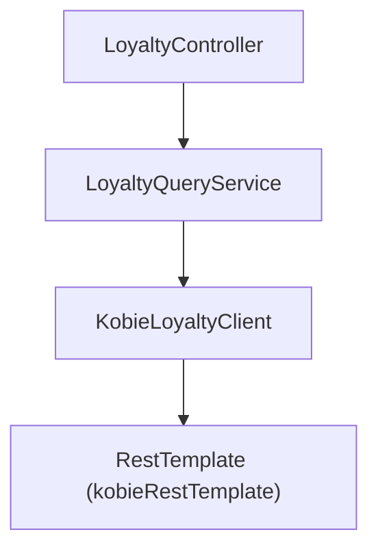
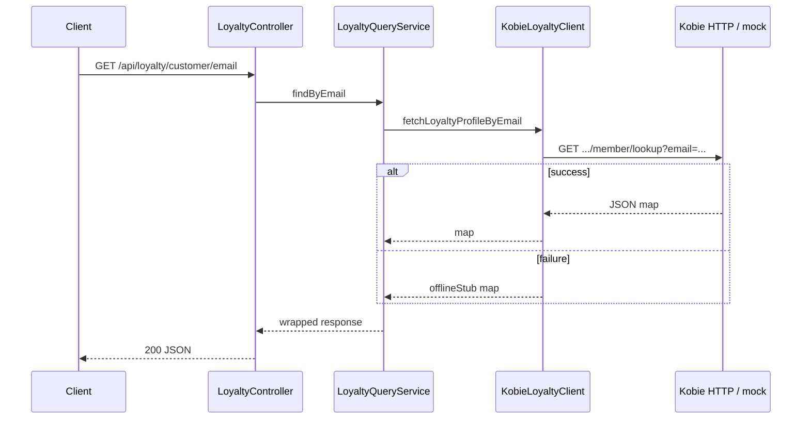
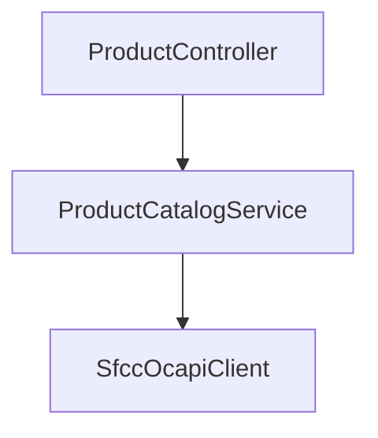
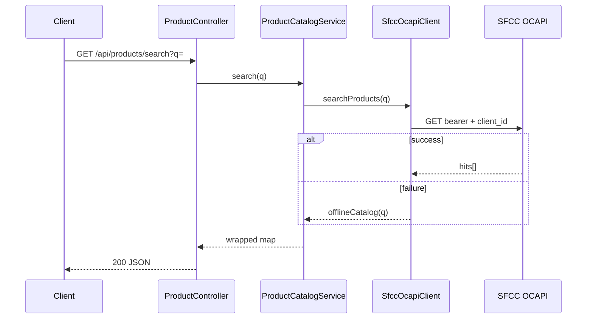
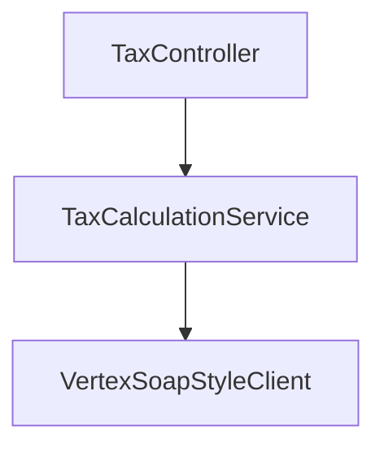
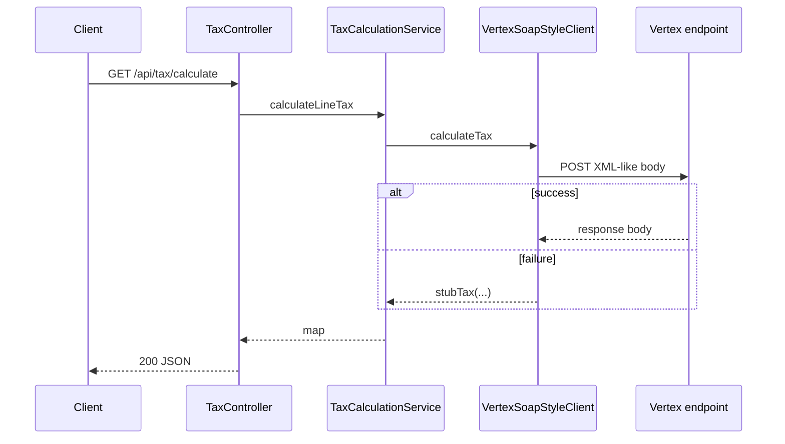

# Legacy POS monorepo — Deepwiki (architecture, modules, diagrams)

This document is the **architecture Deepwiki**: module summaries, type-level explanations, narratives, and **Mermaid** diagrams. For **HTTP contracts, ports, and response shapes**, keep **`docs/DEEPWIKI.md`** as the canonical API reference and align this file when structure changes.

**Generated / refreshed:** manual or CI (set date on update). **Diagram format:** Mermaid embedded below; render to **SVG** for a docs UI as described in [Diagram rendering](#diagram-rendering-svg-for-ui).

---

## How to maintain this Deepwiki (best practice)

| Practice | Why |
|----------|-----|
| **Split concerns** | `DEEPWIKI.md` = API/contract truth; **this file** = structure, behavior narrative, diagrams. |
| **Regenerate on release** | Update summaries and Mermaid when packages, controllers, or integrations change. |
| **Version diagrams with Git** | Store Mermaid **source** in Git; optionally commit **SVG** outputs from CI for stable UI URLs. |
| **Keep diagrams truthful** | Prefer graphs derived from static analysis or reviewed hand-drawn Mermaid; label “approximate” for call graphs without full classpath. |
| **Citations in narrative** | Point to `package` + type name so readers can jump to code. |

---

## 1. Architecture narrative

### 1.1 System context

This repo is a **multi-module Maven workspace** of four **independent** HTTP services. **Program target:** every module is shipped as an **executable JAR** inside an **OCI image** — **no WAR** artifacts or external servlet containers on the **release** path (`docs/DEEPWIKI.md`). **Today:** **three** modules still use Spring Boot **2.7.18** on **Java 8** with Maven **`war`** packaging and `spring-boot-starter-tomcat` **provided** (legacy external Tomcat path); **`customer-lookup-legacy-service`** has completed a **vertical slice** to Spring Boot **3.5.x**, **Java 25**, **Jakarta**, **JAR**, Flyway, Actuator, and observability hooks (details in **`docs/DEEPWIKI.md`**). There is **no Maven parent** tying modules; each module owns its own `pom.xml` and deployable artifact.

Each service is a **small vertical slice**: HTTP API → application service → integration client or persistence. They are **not** wired to each other in-process; any composition happens outside this repo (e.g., API gateway or BFF).

### 1.2 Technical stack

- **Legacy trio (loyalty, products, tax):** Spring Boot Web, **Java 8**; **interim** Maven **WAR** + **provided** Tomcat; **target** same as customer — **`jar`** + embedded Tomcat, **container-only**; `System.out.println` and uneven HTTP client timeouts remain modernization targets.
- **customer-lookup (upgraded slice):** Spring Boot Web + JPA + Flyway + Actuator + Micrometer/Prometheus + OTLP hooks; **executable JAR**; SLF4J on service paths; profile-based config (`application.yml`). See **`docs/DEEPWIKI.md`** for the authoritative stack line.
- **API style (all):** JSON, often `Map<String, Object>` rather than DTOs (legacy style).

### 1.3 Bounded contexts (by module)

| Context | Responsibility | External system |
|---------|----------------|-----------------|
| Customer | CRUD-style lookup and mutation of customers | H2 (file) / JPA today |
| Loyalty | Loyalty profile by email or phone | Kobie HTTP (stub fallback) |
| Products | Product search and fetch | SFCC OCAPI (stub fallback) |
| Tax | Line tax calculation | Vertex-style HTTP (stub fallback) |

---

## 2. Module summaries

### 2.1 `customer-lookup-legacy-service`

| Attribute | Value |
|-----------|--------|
| **Port** | 8081 |
| **Packaging** | JAR (`customer-lookup-legacy`) — container entrypoint |
| **Purpose** | Look up customers by email or telephone; add/update records. |
| **Persistence** | Spring Data JPA + H2 file database (`./data/...`) |
| **API base** | `/api/customer` |

**Summary:** The only module with a **database**. JPA entity maps to `customers`; repository supports email and telephone queries. Service returns legacy map shapes and caps telephone results.

---

### 2.2 `loyalty-kobie-legacy-service`

| Attribute | Value |
|-----------|--------|
| **Port** | 8082 |
| **Packaging** | **Target:** JAR (`loyalty-kobie-legacy`); **today:** WAR (interim) |
| **Purpose** | Expose loyalty points and certificates keyed by email or phone. |
| **Integration** | HTTP client to configurable Kobie base URL; offline stub on failure. |
| **API base** | `/api/loyalty` |

**Summary:** Thin facade over Kobie-shaped HTTP. `RestTemplate` is configured with connect/read timeouts in `KobieIntegrationConfig`.

---

### 2.3 `products-sfcc-legacy-service`

| Attribute | Value |
|-----------|--------|
| **Port** | 8084 |
| **Packaging** | **Target:** JAR (`products-sfcc-legacy`); **today:** WAR (interim) |
| **Purpose** | Product search and product-by-id via SFCC OCAPI-style URLs. |
| **Integration** | Bearer token + host + client id; stub catalog when SFCC unreachable. |
| **API base** | `/api/products` |

**Summary:** `SfccOcapiClient` uses a default `RestTemplate` without shared factory tuning (modernization target). `ProductCatalogService` wraps search and single-product flows.

---

### 2.4 `tax-vertex-legacy-service`

| Attribute | Value |
|-----------|--------|
| **Port** | 8083 |
| **Packaging** | **Target:** JAR (`tax-vertex-legacy`); **today:** WAR (interim) |
| **Purpose** | Line tax calculation from amount + postal code + region. |
| **Integration** | POST pseudo-XML to configurable Vertex endpoint; stub tax math on failure. |
| **API base** | `/api/tax` |

**Summary:** `VertexSoapStyleClient` demonstrates brittle string-built XML; production path should use a supported client/SDK and proper timeouts.

---

## 3. Function and class explanations

### 3.1 Customer lookup (`com.legacy.customer`)

| Type | Layer | Responsibility |
|------|--------|------------------|
| `CustomerLookupApplication` | Boot | `main` + `@EnableConfigurationProperties`. |
| `CustomerLookupController` | Web | Maps `/api/customer/*` to service; translates `NOT_FOUND` / `ERROR` to HTTP status. |
| `CustomerLookupService` | Domain | Lookup by email/phone, add, partial update; builds response maps; cap from `CustomerModuleProperties`. |
| `CustomerRepository` | Persistence | JPA queries: `findByEmailIgnoreCase`, `findByTelephone`. |
| `CustomerEntity` | Model | JPA entity `customers` (`id`, `email`, `telephone`, `firstName`, `lastName`). |
| `CustomerModuleProperties` | Config | `app.customer.*` — `max-results`, per-brand map (`enabled`, `datasource-ref`). |
| `BrandConfigurationValidator` | Config | Fails startup if no enabled brand. |
| `LegacyAppConstants` | Config | Deprecated JDBC fragment / cap constants; prefer env + `CustomerModuleProperties`. |

**Key methods (behavioral):**

- `CustomerLookupService.findByEmail` / `findByTelephone` — core read paths; telephone may return multiple rows capped by `app.customer.max-results`.
- `CustomerLookupService.addCustomer` — requires non-empty email.
- `CustomerLookupService.updateCustomer` — partial field merge then save.

---

### 3.2 Loyalty (`com.legacy.loyalty`)

| Type | Layer | Responsibility |
|------|--------|------------------|
| `LoyaltyKobieApplication` | Boot | Spring Boot entry (`SpringBootServletInitializer` today; **target** plain `main` + **JAR** for containers). |
| `LoyaltyController` | Web | `/api/loyalty/customer/email`, `/customer/phone`. |
| `LoyaltyQueryService` | Domain | Wraps Kobie map into response envelope (`email`, `phone`, `loyaltyPoints`, `certificates`, `kobieRaw`). |
| `KobieLoyaltyClient` | Integration | GET `{base}/member/lookup?...`; stub on `RestClientException`. |
| `KobieIntegrationConfig` | Config | Declares `RestTemplate` bean with 3s connect / 5s read timeout. |

---

### 3.3 Products SFCC (`com.legacy.sfcc`)

| Type | Layer | Responsibility |
|------|--------|------------------|
| `ProductsSfccApplication` | Boot | Spring Boot entry (`SpringBootServletInitializer` today; **target** plain `main` + **JAR**). |
| `ProductController` | Web | `/api/products/search`, `/api/products/{id}`. |
| `ProductCatalogService` | Domain | Adds `source`/`query`/`hits` or `product` wrapper around client. |
| `SfccOcapiClient` | Integration | OCAPI product search GET with bearer auth; offline stub list on failure. |

---

### 3.4 Tax Vertex (`com.legacy.tax`)

| Type | Layer | Responsibility |
|------|--------|------------------|
| `TaxVertexApplication` | Boot | Spring Boot entry (`SpringBootServletInitializer` today; **target** plain `main` + **JAR**). |
| `TaxController` | Web | GET `/api/tax/calculate`. |
| `TaxCalculationService` | Domain | Parses amount to `BigDecimal`, delegates to client, returns merged map. |
| `VertexSoapStyleClient` | Integration | POST XML-like body; merges/stubs tax result on failure. |

---

## 4. Diagrams (Mermaid)

### 4.1 Dependency graph — Maven modules (no inter-module deps)

Modules only depend on **Spring Boot** and their own stack; they do not depend on each other.

---

### 4.2 Import / package dependency (within module — customer)

---

### 4.3 Call graph (approximate AST-level — customer lookup)

---

### 4.4 Data flow — HTTP to persistence (customer)

---

### 4.5 Call graph — loyalty

---

### 4.6 Data flow — loyalty to Kobie (or stub)

---

### 4.7 Call graph — products SFCC

---

### 4.8 Data flow — products search

---

### 4.9 Call graph and data flow — tax

---

## 5. Diagram rendering (SVG for UI)

| Approach | When to use |
|----------|-------------|
| **Mermaid in GitHub / GitLab** | Native rendering in Markdown UI; zero build step. |
| **`@mermaid-js/mermaid-cli` (`mmdc`)** | CI generates **SVG** from `.md` or `.mmd` into `docs/diagrams/svg/` for a static site or internal portal. |
| **PlantUML** | Heavier diagrams; use `plantuml.jar` or Docker image in CI → SVG/PNG. |
| **Docs site (Docusaurus, MkDocs + plugin)** | Embed same Mermaid blocks; theme controls fonts and export. |

**Recommended CI pattern:** keep **Mermaid source only** in this repo; optional job `render-diagrams` commits or uploads SVG artifacts for your UI pipeline.

---

## 6. Related documents

| Document | Role |
|----------|------|
| `docs/DEEPWIKI.md` | API, ports, config keys, response contracts |
| `docs/CLAUDE_MODERNIZATION_PLAYBOOK.md` | Agents and modernization gates |
| `docs/MULTI_BRAND_ARCHITECTURE.md` | Multi-brand canonical model and adapters |
| `docs/TWELVE_FACTOR.md` | Twelve-factor checklist |
